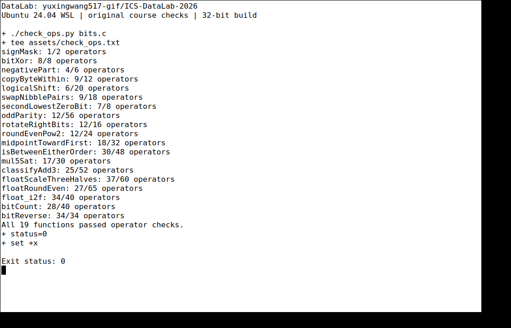
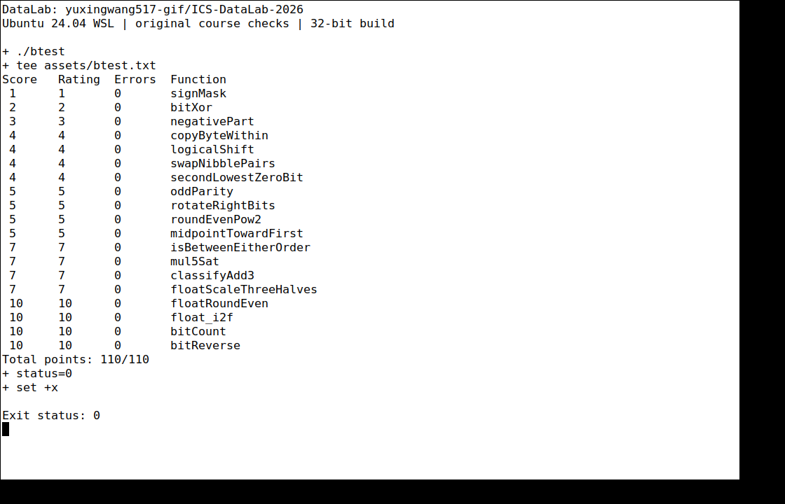

# Lab1：DataLab 实验报告

- 姓名：王宇行
- 学号：24300680259
- 实验日期：2026 年 10 月 9 日
- 个人仓库：[yuxingwang517-gif/ICS-DataLab-2026](https://github.com/yuxingwang517-gif/ICS-DataLab-2026)

## 1. 实验目标与环境

本实验通过 19 个函数练习 32 位二进制补码、掩码、移位、溢出判断和 IEEE 754 单精度浮点数的位级表示。整数题仅使用题目允许的运算符与小常量；浮点题使用整数处理浮点编码，不使用浮点类型、类型转换或函数调用。

仓库通过 GitHub 的模板生成功能从 `ICS-26Fall-FDU/DataLab` 创建，未使用 Fork。实现只修改 `bits.c` 的 P1–P19 函数体，保留原始函数签名、测试程序和 `.github` 下的评分配置。实验报告和测试证据单独添加。

本地环境为 Windows 上的 WSL Ubuntu 24.04，安装 GCC、Make、Python 3 及 32 位编译依赖。使用原始 Makefile 的 `-O -Wall -fwrapv -m32` 参数构建。Windows 克隆时产生的脚本换行格式被恢复为模板中的 LF 格式，未改变检查器逻辑或评分文件。

## 2. 测试结果与截图

下列截图来自 Ubuntu 中的 xterm 终端，使用独立虚拟显示器截取实际命令输出，未根据文字记录重绘测试结果。

在实验仓库目录中执行：

```sh
make clean
make all
./check_ops.py bits.c
./btest
```

规则检查结果为 `All 19 functions passed operator checks.`；所有函数均满足合法运算符及最大操作数限制。其中 `bitReverse` 使用 34 个操作，恰好达到该题上限。原始输出见 [规则检查记录](assets/check_ops.txt)。



正确性测试中 19 个函数的 `Errors` 均为 0，最终结果为 `Total points: 110/110`。原始输出见 [btest 记录](assets/btest.txt)。



代码推送后的 [GitHub Actions 评分运行](https://github.com/yuxingwang517-gif/ICS-DataLab-2026/actions/runs/37938820602)也成功，评分日志报告 `Points 110/110`。这表示自动测试通过，实验报告仍由助教按课程规则评阅。

## 3. 各函数的实现思路

| 题号与函数 | 操作数 / 上限 | 实现思路与边界处理 |
|---|---:|---|
| P1 `signMask` | 1 / 2 | 将常量 1 左移 31 位，构造只有符号位为 1 的掩码。按课程 32 位位向量模型解释结果。 |
| P2 `bitXor` | 8 / 8 | 异或为“只有一侧为 1”。分别得到 `x & ~y` 和 `~x & y`，再用德摩根律以 `~`、`&` 实现二者的或，避免使用禁用的 `^`、`|`。 |
| P3 `negativePart` | 4 / 6 | 算术右移 31 位获得负数的全 1 掩码或非负数的全 0 掩码，与补码相反数 `~x + 1` 相与。`INT_MIN` 的相反数按题目规定保留低 32 位。 |
| P4 `copyByteWithin` | 9 / 12 | 将字节编号左移 3 位转为位偏移。先提取源字节，再清空目标字节，最后把源字节放入目标位置。即使源和目标相同，也不改变其他字节。 |
| P5 `logicalShift` | 6 / 20 | 先做算术右移，再用有效低位掩码清除补入的符号位。掩码由最高位右移后再左移一位构造，使 `n=0`、`n=31` 都无需移位 32 位。 |
| P6 `swapNibblePairs` | 9 / 18 | 构造 `0x0f0f0f0f` 掩码，各字节的低半字节左移 4 位，高半字节右移后掩去符号扩展，再合并。 |
| P7 `secondLowestZeroBit` | 7 / 8 | 将 `x` 取反，使零位变为一位；用 `y & (y-1)` 删除最低一位，再用 `y & (-y)` 隔离新的最低一位。减一与负数均以合法的补码表达式构造；不足两个零位时结果为 0。 |
| P8 `oddParity` | 12 / 56 | 通过右移 16、8、4、2、1 位并异或，把 32 位的一位数量奇偶性逐层折叠到最低位。最后取反，使原一位数为偶数时返回 1。 |
| P9 `rotateRightBits` | 12 / 16 | 用 `n & 31` 将旋转位数归约到 0–31。右侧使用逻辑右移掩码，左侧的补回位数用补码取负后与 31 相与，避免旋转 0 位时出现移位 32 位。 |
| P10 `roundEvenPow2` | 12 / 24 | 设步长为 `2^n`，加入“半步长减一加商的奇偶位”的偏置，再清除低 `n` 位。余数超过半程时进位；恰好半程时只在商为奇数时进位，实现就近偶数舍入。 |
| P11 `midpointTowardFirst` | 18 / 32 | 用 `(x & y) + ((x ^ y) >> 1)` 得到向下取整的中点，避免直接相加溢出。仅当和为奇数且 `x > y` 时加 1，使结果靠近第一个参数。比较时分开处理异号和同号，避免差值溢出造成误判。 |
| P12 `isBetweenEitherOrder` | 30 / 48 | 分别判断 `x < a`、`x < b`，异号时直接用符号位，同号时使用差值符号。两个“小于”判断不相同时处于端点之间，再显式加入等于任一端点的情形，支持端点倒置和极值。 |
| P13 `mul5Sat` | 17 / 30 | 逐步得到 `2x`、`4x`、`5x`，检查同号加法前后是否改变符号。任何一步溢出即按原 `x` 的符号选择 `INT_MAX` 或 `INT_MIN`；否则返回乘积。 |
| P14 `classifyAdd3` | 25 / 52 | 将每个整数分为有符号高 16 位和无符号低 16 位。低位相加产生进位，再相加高位和进位，所有这些中间量均可由 `int` 保存。高位超过 32767 时返回 1，低于 -32768 时返回 -1，否则返回 0，避免逐次 32 位相加丢失真实溢出信息。 |
| P15 `floatScaleThreeHalves` | 37 / 60 | 拆分符号、阶码、尾数，将有效尾数乘 3 后右移 1 或 2 位。通过余数与半程比较，并在中点检查保留位的奇偶性完成一次就近偶数舍入。非规格化数使用独立路径，保留正负零；NaN 原样返回，阶码溢出返回带符号的无穷大。 |
| P16 `floatRoundEven` | 27 / 65 | 阶码足够大时输入已为整数，包含 NaN 和无穷大的路径也原样返回。绝对值小于 0.5 时返回带原符号的零，恰好 0.5 舍入到零。其余情况清除表示小数的尾数低位，比较余数与半程，根据整数部分奇偶性决定进位。 |
| P17 `float_i2f` | 34 / 40 | 用无符号量取得绝对值，正确处理 `INT_MIN`。寻找最高一位以确定阶码；有效位数不超过 24 位时精确对齐，否则保留高 24 位，并按丢弃位进行就近偶数舍入。舍入导致尾数进位时再次调整阶码。 |
| P18 `bitCount` | 28 / 40 | 构造 `0x55555555`、`0x33333333`、`0x0f0f0f0f` 掩码，先并行统计每 2、4、8 位中的一位数量，再把各字节的计数相加，最终取低 6 位获得 0–32 的结果。 |
| P19 `bitReverse` | 34 / 34 | 依次交换 16、8、4、2、1 位分组。交换 16 位时用原符号扩展掩码抵消算术右移引入的高位。由 `0x00ff00ff` 逐层异或移位构造后续掩码，节省操作数，使总数达到但不超过 34。 |

## 4. 辅助工具、参考资料与总结

本次推导、代码实现、环境配置、验证和报告整理使用了 Codex AI 助手辅助。上述内容据实际代码与测试结果整理，未复制其他同学或网络题解的实现。报告不将辅助完成的过程表述为完全独立完成。

参考材料：

1. [课程 Lab1：DataLab 文档](https://ics-26fall-fdu.github.io/labs/lab1-data-lab/)：实验要求、报告格式与评分规则。
2. [课程 DataLab 模板 README](https://github.com/ICS-26Fall-FDU/DataLab/blob/main/README.md)及 [`bits.c` 原始注释](https://github.com/ICS-26Fall-FDU/DataLab/blob/main/bits.c)：函数语义、合法运算符、操作数上限和机器模型。
3. 模板中的 `tests.c`、`check_ops.py` 和 `btest`：用于对照预期行为并执行原始检查，未修改其测试或评分逻辑。

实验中需要同时区分“算法结果正确”和“写法符合题目规则”：正确性测试通过不代表运算符合法，规则检查通过也不代表结果正确。溢出、算术右移的符号扩展、移位量为 0 或 31、浮点半程舍入及特殊值是本次实现的主要边界。
